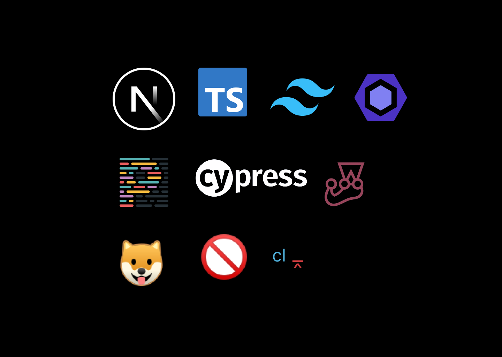

<p align="center">
  
</p>

<p align="center">
  

  

  <a href="https://twitter.com/intent/follow?screen_name=hunchodotdev">
    
  </a>
</p>

<br>

A Next.js starter that includes all you need to build amazing projects 🔥. Fork and customize from [lucky-chap](https://github.com/lucky-chap/kaminari)

- 🚀 **Next.js 13**
- ⚙️ **Tailwind CSS 3** - A utility-first CSS framework
- 🍓 **TypeScript** - JavaScript superset
- 📏 **ESLint** — Pluggable JavaScript linter
- 💖 **Prettier** - Opinionated Code Formatter
- 🐶 **Husky** — Use git hooks with ease
- 🚫 **lint-staged** - Run linters against staged git files
- 🚫 **commitlint** - Lint your commits and adhere to a commit convention
- 🃏 **Jest** - The delightful JavaScript Testing Framework
- 🗂 **Absolute import** - Import folders and files using the `@` prefix

## 🚀 Getting started

The best way to start with this template is using `create-next-app`.

```
npx create-next-app my-app -e https://github.com/lucky-chap/kaminari
```

If you prefer you can clone this repository and run the following commands inside the project folder:

1. `npm install` or `yarn`;
2. `yarn dev`;

To view the project open `http://localhost:3000`.

## ✨ Star

I want this project to go far. Please show your support by starring it. Thank you!

## 🤝 Contributing

1. Fork this repository;
2. Create your branch: `git checkout -b my-new-feature`;
3. Commit your changes: `git commit -m 'Add some feature'`;
4. Push to the branch: `git push origin my-new-feature`.

**After your pull request is merged**, you can safely delete your branch.

## 📝 License

This project is licensed under the MIT License - see the [LICENSE](LICENSE) file for more information.

---

Made with ♥ by [Quavo](https://twitter.com/hunchodotdev)

## 🔗 Important Things To Note

- Blog page is renedered client side. This is because the MDX files are local, and using server-side rendering for local files wouldn't make much sense.

## 🔗 Important Links

- [Custom Cypress Config](https://github.com/cypress-io/cypress/issues/22059#issuecomment-1178574704)
